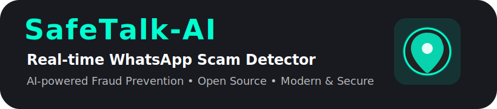

<p align="center">
  
</p>

<p align="center">
  
  
  
  
  
  
  
  
  
  
  
  
</p>

# SafeTalk-AI 🛡️🤖

**SafeTalk-AI** is a cutting-edge, real-time AI chatbot for WhatsApp, designed to automatically detect and prevent scams and social engineering attacks through advanced natural language processing.  
This project combines FastAPI, Python, machine learning and WhatsApp Web automation to deliver a market-ready, scalable and highly effective antifraud solution.

---

## 🚀 Features

- **Real-time WhatsApp Monitoring:** Intercepts and analyzes incoming messages, voice notes and media in real time.
- **AI-Powered Scam Detection:** Uses a trained ML model to classify messages as legitimate or scam, with confidence scores.
- **Audio Transcription:** Converts voice messages to text and analyzes them for scam content (powered by Whisper).
- **Automated Alerts:** Instantly notifies users and administrators of suspected scams.
- **Easy Integration:** Ready to deploy and scale for individuals, businesses, or integration with exchanges and fintechs.
- **Extensible Architecture:** Modular backend (FastAPI) and bot (Node.js/whatsapp-web.js) ready for future improvements.

---

## 🏆 Why SafeTalk-AI?

- **Visionary Solution:** Proactive fraud prevention, not just detection.
- **Plug & Play:** Simple to set up locally or in the cloud.
- **Enterprise-Ready:** Perfect for B2B, exchanges, banks, and customer support.
- **Highly Customizable:** Retrain the model or expand rules as new scams appear.
- **Free and Open Source:** Perfect for learning, adaptation, and business adoption.

---

## 📦 Project Structure
```
/backend              # FastAPI backend, ML logic
/data/messages.csv    # Training dataset (no sensitive data)
/model/*.joblib       # Trained AI model and vectorizer
/whatsapp-bot         # WhatsApp Web integration (Node.js)
  └── audios/         # Temporary audio storage (ignored)
/docs                 # (Optional) Visuals, diagrams, etc.
requirements.txt      # Python dependencies
package.json          # Node dependencies (bot)
/.github              # Workflows, issue templates (optional)
```
---

## ⚡️ Quickstart

### 1. Clone the repository

```bash
git clone https://github.com/cshillrj46/SafeTalk-AI.git
cd SafeTalk-AI

python -m venv .venv
# Windows:
.venv\Scripts\activate
# Linux/Mac:
source .venv/bin/activate

pip install --upgrade pip
pip install -r requirements.txt

python backend/train_model.py

uvicorn backend.main:app --reload

cd whatsapp-bot
npm install
node whatsapp-web.js

A browser will open with a QR Code. Scan it using your WhatsApp to connect the bot.

7. Test the Bot!
Send scam and legit messages or voice notes to your WhatsApp connected to the bot.

The bot will transcribe audio, analyze text and automatically alert on any suspicious content.

🧠 How it works
Incoming message/voice note: The bot receives content via WhatsApp Web.

Audio transcription: Voice notes are converted to text (Whisper).

AI analysis: The backend receives the message, extracts features and predicts scam/legitimate status.

Response: Alerts are sent back to the WhatsApp user if a scam is detected, with details and confidence score.

💡 Customization
Improve detection: Add more samples to data/messages.csv and retrain.

Add business logic: Customize backend/model.py for new scam patterns.

Change notification targets: Adapt the bot to forward alerts to admin numbers, emails or external APIs.

🤝 Contributing
Pull requests, issue reports and suggestions are welcome!
If you use or adapt SafeTalk-AI for business, a mention or star is appreciated.

🔒 Security Notice
Production Use: If deploying commercially, set up proper environment variables, secure endpoints, and never expose sensitive training data.

WhatsApp Bot: Use a dedicated number/account. Excessive automation may risk account ban.

Data: Do NOT share real user conversations in public repositories!

📄 License
MIT License

👨‍💻 Author
Developed by Cristiano Hill & OpenAI GPT-4o
Feel free to connect on LinkedIn or GitHub.

📣 Like this project? Star, fork or share with your network!
SafeTalk-AI: Bringing AI-powered security to your daily conversations.
