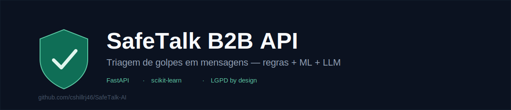

<div align="center">



[](https://github.com/cshillrj46/SafeTalk-AI/actions/workflows/ci.yml)
[](LICENSE)
[](https://www.python.org/)
[](https://fastapi.tiangolo.com/)
[](#limitações-conhecidas)

</div>

API de triagem de mensagens para detecção de golpes e engenharia social em
canais de atendimento (WhatsApp Business API, chat web, SMS) — pensada para
ser integrada em sistemas de bancos e fintechs, não para ser um bot fechado
de WhatsApp.

## Sumário

- [Por que essa arquitetura](#por-que-essa-arquitetura)
- [Como funciona](#como-funciona)
- [Quickstart](#quickstart)
- [Usando a API](#usando-a-api)
- [Testes](#testes)
- [Estrutura do projeto](#estrutura-do-projeto)
- [Limitações conhecidas](#limitações-conhecidas)
- [Licença](#licença)

## Por que essa arquitetura

<details>
<summary><strong>Este repositório substitui um protótipo anterior baseado em automação não-oficial de WhatsApp Web. Clique para ver o que mudou.</strong></summary>

| Aspecto | Protótipo original | Esta versão |
|---|---|---|
| Canal | `whatsapp-web.js` (não-oficial, risco de ban) | API pura — o cliente usa o próprio canal oficial |
| ML | RandomForest sem validação cruzada | LogisticRegression com cross-validation e relatório salvo |
| Privacidade | Nenhuma anonimização | Anonimização antes de qualquer persistência |
| Decisão | Único modelo, sem segunda opinião | Regras → ML → LLM, com fallback gracioso em cada etapa |
| Testes | `assert 1+1==2` | 21 testes reais cobrindo regras, anonimização, pipeline e API |
| Dependências | `requirements.txt` não correspondia ao código | Corrigido e versionado |

Detalhes completos em [`docs/architecture.md`](docs/architecture.md).

</details>

## Como funciona

```
Mensagem do chat
        │
        ▼
┌─────────────────────────────────────────────┐
│           Plataforma SafeTalk B2B            │
│  ┌───────────┐  ┌────────────┐  ┌──────────┐ │
│  │ Ingestão  │─▶│  Detecção  │─▶│ Resposta│ │
│  │(auth, PII)│  │  híbrida   │  │ & score  │ │
│  └───────────┘  └────────────┘  └──────────┘ │
└─────────────────────────────────────────────┘
        │
        ▼
Alerta / score ao analista (resposta da API)
```

1. **Ingestão** — autenticação por API key, rate limiting, anonimização de
   CPF/telefone/e-mail/cartão antes de qualquer log.
2. **Detecção híbrida** — regras heurísticas (baratas e rápidas) cobrem os
   golpes mais óbvios; um modelo de ML cobre o grosso dos casos; um LLM
   entra só como segunda opinião nos casos ambíguos.
3. **Resposta & score** — devolve um veredito estruturado (`risco`,
   `confiança`, `motivo`, `fonte`) para o sistema do cliente decidir o que
   fazer — bloquear, escalar para um analista, ou alimentar um dashboard.

## Quickstart

```bash
python -m venv .venv
source .venv/bin/activate          # Windows: .venv\Scripts\activate

pip install -r requirements.txt
cp .env.example .env                # edite se quiser configurar ANTHROPIC_API_KEY

python training/generate_synthetic_dataset.py
python training/train_model.py

uvicorn app.main:app --reload
```

A API sobe em `http://localhost:8000` — documentação interativa em
`http://localhost:8000/docs`.

## Usando a API

```bash
curl -X POST http://localhost:8000/v1/analyze \
  -H "X-API-Key: dev-key-local" \
  -H "Content-Type: application/json" \
  -d '{"message": "Pix urgente agora, troquei de número, me ajuda!"}'
```

```json
{
  "request_id": "293956ff-a0e5-4160-9eb5-7de4e2819c51",
  "risk": "alto",
  "confidence": 0.88,
  "reason": "Classificação pelo modelo de machine learning treinado.",
  "triggered_rules": ["pix_urgente"],
  "source": "ml"
}
```

## Testes

```bash
pytest -v
```

21 testes cobrindo o motor de regras, a anonimização, o pipeline de decisão
e os endpoints da API — rodam automaticamente em todo push via GitHub
Actions (badge de CI no topo deste README).

## Estrutura do projeto

```
app/
├── api/v1/        # endpoints (POST /v1/analyze, GET /v1/stats/summary)
├── core/          # auth, rate limiting, anonimização
├── detection/      # regras, modelo de ML, fallback de LLM, pipeline
├── audit/          # log de auditoria (SQLite)
└── main.py
training/           # gerador de dataset sintético + script de treino
tests/               # testes pytest
docs/architecture.md # detalhamento da arquitetura
```

## Limitações conhecidas

Sem rodeio — isto é um MVP, não um produto pronto para produção:

- **Dataset de treino é sintético** (template-based). Suficiente para o
  pipeline funcionar de ponta a ponta; insuficiente para produção. Próximo
  passo real: dataset com mensagens reais anonimizadas, via parceria ou
  opt-in de usuários.
- **Anonimização é baseada em regex** — cobre CPF, CNPJ, telefone, e-mail e
  cartão, mas não nomes próprios ou endereços em texto livre.
- **Rate limiting é em memória** — válido para uma única instância;
  múltiplas réplicas precisam de Redis ou um API gateway dedicado.
- **Log de auditoria em SQLite** — adequado para MVP/demo, não para alto
  volume multi-cliente em produção (migrar para Postgres).

## Licença

MIT — ver [LICENSE](LICENSE).
